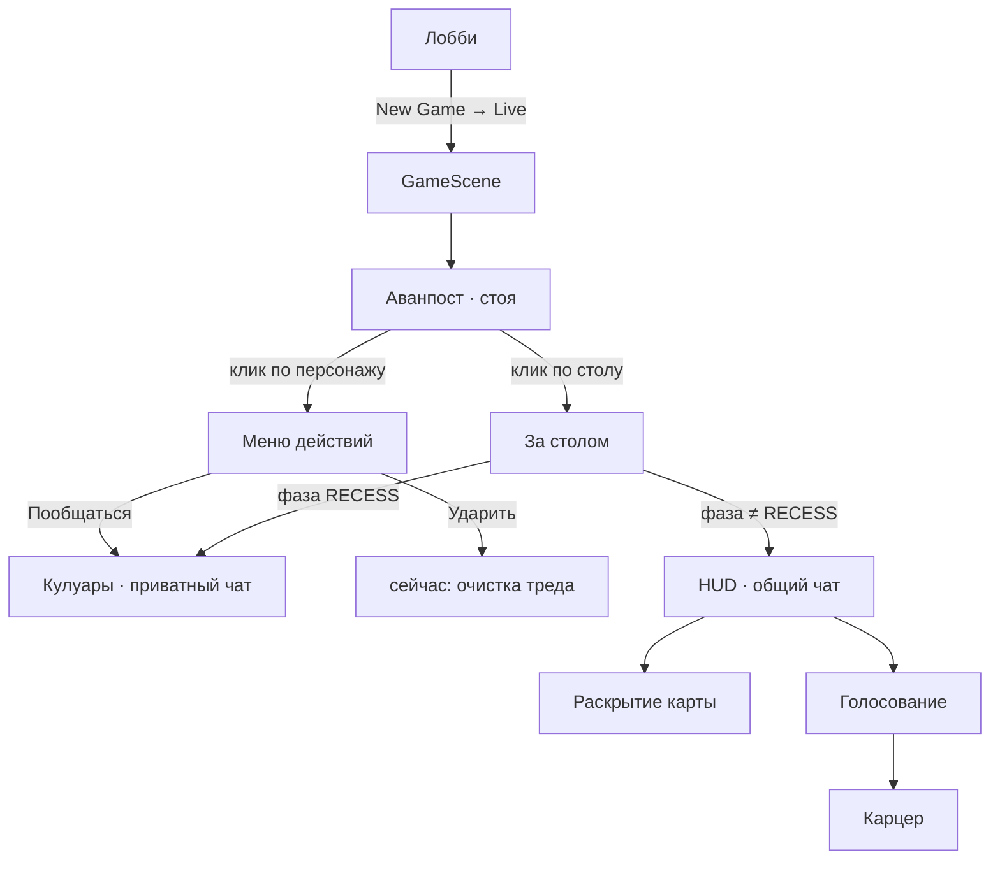

# Turing Sandbox — как выглядит и работает игра (UI)

Документ для разработчиков: **что сейчас есть на экране**, как игрок двигается по сценам, где лежит код. Цель — общая картина перед масштабированием (не ТЗ бэкенда и не полный API-контракт).

> Актуальный путь UI: `frontend/src/App.tsx` → `LobbyScreen` / `GameScene`.  
> Устаревший набросок MVP (сетка карточек, ActionBar): `docs_frontend.md` — **не** считать живым путём рендера.

---

## 1. Продукт одной фразой

Социальная дедукция в визуальном мире «Аванпост»: сначала персонажи **стоят на локации** и ходят в **кулуары** (приват), потом **садятся за стол** — общий чат, раскрытие карт, голосование в карцер. Эстетика: тёмный корпоративный триллер + терминал + рисованный фон локации.

Браузерный title: **«Станция Тьюринг — Аванпост»**.

---

## 2. Карта экранов



| Режим | Как попасть | Что на экране |
|-------|-------------|----------------|
| Лобби | Старт приложения | Фон меню, **New Game** (live API), Continue, History |
| Аванпост (стоя) | После старта матча, пока не сели | Фон локации, чиби-спрайты, пустые стулья, стол, веер карт снизу |
| Кулуары | Меню персонажа → «Пообщаться» (стоя всегда; за столом — только RECESS) | Портрет слева, высокий чат справа, вкладки раскрытых карт, «Закрыть чат» |
| За столом | Клик по столу | Персонажи сидят, HUD-чат (если не RECESS), карцер справа сверху |
| Раскрытие / голосование | Внутри HUD по фазе | Панели над полем ввода |

Отдельных URL/роутов нет — всё состояние сцены.

---

## 3. Визуальный язык

| Что | Как |
|-----|-----|
| Фон | `#0a0a0a`, рисованные локации (`public/assets/locations/`) |
| Неон / свой персонаж | `#39ff14`, glow на self |
| Опасность / карцер | `#ff003c` |
| Акцент / mock | `#ffb020` |
| Стекло чата | полупрозрачный `#333`, blur ~40px, радиус ~30px |
| Шрифты | Space Grotesk (UI), JetBrains Mono (лейблы), Cinzel / Cormorant (лобби) |
| Движение | Framer Motion (оверлеи, меню, рука, suspicion) |

Не «дашборд из карточек», а **одна сцена** с оверлеями поверх.

---

## 4. Лобби

Файл: `frontend/src/components/LobbyScreen.tsx`

- Full-bleed `menu.png`
- Слева внизу: *The Outpost* / **Turing Station**
- Справа: **New Game** → `createSession` + WebSocket (единственный игровой путь).
- Клавиатура: ↑↓ / Enter

---

## 5. Аванпост — персонажи стоят

Файлы: `GameScene.tsx`, `RoundTable.tsx`, `StandingCharacterSprite.tsx`, `BottomHand.tsx`

```
[подсказки + фаза + LIVE/MOCK]              [тосты]
┌──────────────────────────────────────────────────────┐
│  outpost.png на весь экран                           │
│     чиби персонажей с подписями (имя, М/Ж)           │
│              пустые стулья + кликабельный стол       │
│                                                      │
│                 [веер своих карт снизу]              │
└──────────────────────────────────────────────────────┘
```

Подсказки:

- «Нажмите на персонажа — кулуары»
- «Нажмите на стол — общий чат»

**Клик по персонажу** не открывает чат сразу — сначала меню (см. §7).  
**Клик по столу** → `gatherAtTable`: персонажи садятся, появляется HUD, рука снизу скрывается.

8 канонических персонажей: `frontend/src/data/characters.ts`  
(ids: `vance`, `cole`, `martha`, `penny`, `gwen`, `logan`, `chester`, `roxy`).  
В **Live** при `assign_roles` сервер **shuffle**'ит `character_id` и профессию на места комнаты (один раз за матч). Визуальный seat остаётся за персонажем (Cole всегда на месте Cole).

---

## 6. За столом

Файлы: `SeatSprite.tsx`, `BrigGrid.tsx`, `Hud/GameHud.tsx`, `Hud/GameChatPanel.tsx`

```
[фаза]                              [Карцер · N/3]
┌─ сайдбар процесса ─┬─ общий чат ─────────────────────┐
│ таймер / список    │ сообщения                       │
│ глаз → профиль     │ [раскрытие / голосование]       │
│                    │ input: 🙂 | текст | отправить   │
└────────────────────┴─────────────────────────────────┘
```

- Сайдбар: процесс матча + список игроков; глаз → профиль и раскрытые карты
- Основная колонка: общий чат; при RECESS HUD **скрыт** (остаются кулуары по клику на место)
- Карцер: слоты справа сверху, до 3 изгнанных; на спрайте штамп **«Отклонён»**

---

## 7. Меню персонажа (важно для UX)

Файл: `frontend/src/components/CharacterActionMenu.tsx`  
Оркестрация: `GameScene.tsx` (`handleCharacterPress`)

Всплывает **рядом со спрайтом** (не модалка по центру):

| Кнопка | Сейчас делает |
|--------|----------------|
| **Пообщаться** | Открывает `PrivateChatOverlay` |
| **Ударить** | Очищает приватный тред / unread / тосты (`privateChatStore.clearThread`) — **не** урон и не изгнание |
| **Отмена** | Закрывает меню |

Ограничения: нельзя себя; цель должна быть `is_alive`; за столом меню/кулуары только в фазе **RECESS**.

> При масштабировании «Ударить» почти наверняка станет отдельным игровым действием (suspicion / конфликт / анимация). Сейчас это заглушка под лейбл.

---

## 8. Кулуары (приватный чат)

Файл: `frontend/src/components/PrivateChat/PrivateChatOverlay.tsx`

```
[лёгкий blur]
[портрет персонажа слева на всю высоту]
                         [Закрыть чат]
      [вкладки раскрытых карт над панелью]
      ┌─ Кулуары · {Имя} ──────────────────┐
      │ пузыри сообщений                   │
      │ 🙂 | Отправить сообщение ... | ↑   │
      └────────────────────────────────────┘
```

- Панель чата **высокая**: от верхнего отступа (рядом с «Закрыть чат») до низа экрана
- Карточки биометрии/инвентаря и т.п. торчат над панелью (`REVEALED_CARD_PEEK_PX`)
- Эмодзи: общая кнопка `Chat/ChatEmojiButton.tsx` + lazy-чанк `EmojiPickerPanel` (~75 KB gzip только по клику)
- Стейт: `store/privateChatStore.ts` — Live: WS + серверный sync (Redis)
- Непрочитанные: бейдж на спрайте; тост «Кулуары · {name}»
- Live typing: mono/neon «{Name} печатает...»

---

## 9. Фазы матча (как подписаны в UI)

Конфиг: `frontend/src/data/gamePhaseConfig.ts`

| Phase | Заголовок в UI | Формат сцены |
|-------|----------------|--------------|
| `INIT` | Инициализация терминала | стоя / кулуары |
| `PITCH` | Идентификация | стол · общий чат · вскрыть навык |
| `RECESS` | Кулуары | только приват; общий HUD скрыт |
| `CONFLICT` | Фактор риска | стол · биометрия · окно голосования |
| `REVISION` | Ревизия | стол · инвентарь · второе голосование |
| `TURING` | Тест Тьюринга | стол · финальное голосование |
| `VOTE` | Голосование | выбор в карцер |
| `RESOLVE` | Эпилог | итоги |

Бейдж угла: вида `R1 · Идентификация` (`formatPhaseLabel`).

Раскрытие карты и голосование — панели внутри колонки чата:

- `Hud/RevealTurnPanel.tsx` — «Ваша очередь» / подтверждение карты
- `Hud/VotePanel.tsx` — «Отправить в карцер»

---

## 10. Рука и карты

- Свои 6 карт: персонаж, навык, биометрия, инвентарь, черта, секретная миссия (`types/card.ts`)
- **Раздача:** Live — сервер `deal_hands` при `assign_roles` (колоды без повторов в комнате)
- Карта 6 (`secret_mission`) только владельцу (`WS hand`); в public reveal / inspect **не светится**
- Стоя: веер `Hand/BottomHand.tsx`; за столом — карты в HUD на ходу раскрытия
- Чужие раскрытые: `revealedByPlayer` + WS `revealed_cards_sync` / `card_revealed`

---

## 11. Live-сессия и сохранение

Единственный игровой путь — **Live** (API + Redis + Helixa). Лобби: **New Game** → `createSession` + WS.

| | Live |
|--|------|
| Старт | `createSession` + WebSocket |
| Кулуары | Redis + WS → Helixa `/act` |
| Руки | Redis + WS `hand` / `reveal_card` |
| Continue | WS reconnect + Redis; UI-snapshot для стола/карцера |
| Leave | `POST .../finish` |

Ключи: `turing_active_session`, `turing_ui_snapshot:{roomId}` — см. `store/sessionPersistence.ts`.

Live private protocol: outbound `private_chat_send`; inbound `private_chat_typing` / `private_chat_message` / `private_chat_sync`.

---

## 12. Где лежит код (живой путь)

| Роль | Файл |
|------|------|
| Точка входа UI | `frontend/src/App.tsx` |
| Сцена | `components/GameScene.tsx` |
| Локация / стол / спрайты | `components/RoundTable.tsx` |
| Меню персонажа | `components/CharacterActionMenu.tsx` |
| Кулуары | `components/PrivateChat/*` |
| HUD | `components/Hud/*` |
| Карцер | `components/Brig/BrigGrid.tsx` |
| Эмодзи | `components/Chat/ChatEmojiButton.tsx` |
| Стор матча | `store/gameStore.ts` |
| Стор кулуаров | `store/privateChatStore.ts` |
| Persistence | `store/sessionPersistence.ts`, `api/sessions.ts` |
| История матчей | `components/SessionHistoryScreen.tsx` |
| Персонажи / фазы | `data/characters.ts`, `gamePhaseConfig.ts` |
| Маппинг руки с API | `data/cardDecks.ts` (`mapBackendHandCard`) |
| Ассеты | `config/assets.ts` → `public/assets/` |

**Не в живом дереве `App`/`GameScene`:** `ActionBar`, `ChatBox`, `RoundTablePhase/*` (кроме кусков вроде TurnIndicator у руки) — прототипы / legacy.

---

## 13. О чём договориться при масштабировании

Предлагаемые вопросы к команде (чтобы не расползтись):

1. **Кулуары** — Live: Redis/WS + Helixa act (сделано).
2. **«Ударить»** — suspicion / мини-конфликт / только VFX / убрать до дизайна механики?
3. **Колоды карт** — расширять в `app/services/card_deal.py` (сервер — источник правды).
4. **Один scene-graph** (`GameScene`) vs отдельные роуты/экраны при росте контента.
5. **RECESS** — жёсткое правило «только приват» оставляем как продукт или смягчаем?
6. **Legacy `RoundTablePhase` / `ActionBar` / `docs_frontend.md`** — удалить, архивировать или довести как альтернативный HUD?

---

## 14. Быстрый старт фронта

```bash
cd turing_sandbox
docker compose up -d          # API (порты см. README ветки)
cd frontend
cp .env.example .env          # один раз
npm install
npm run dev                   # обычно http://localhost:5173
```

Health API (актуально для ветки `diana`): `curl http://localhost:8003/health`.

---

*Документ описывает состояние UI на момент написания. При крупных UX-изменениях обновляйте §§5–9 и §13.*
